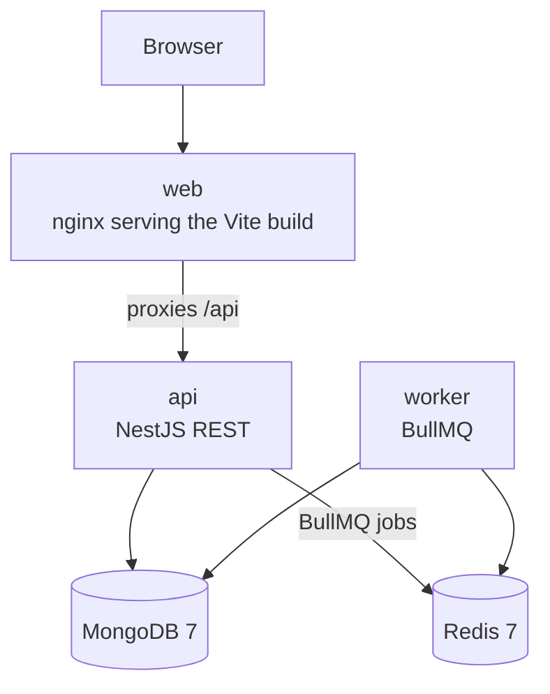
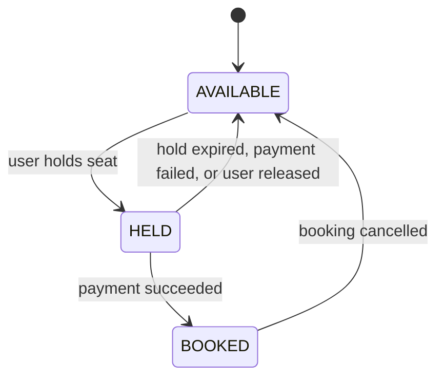
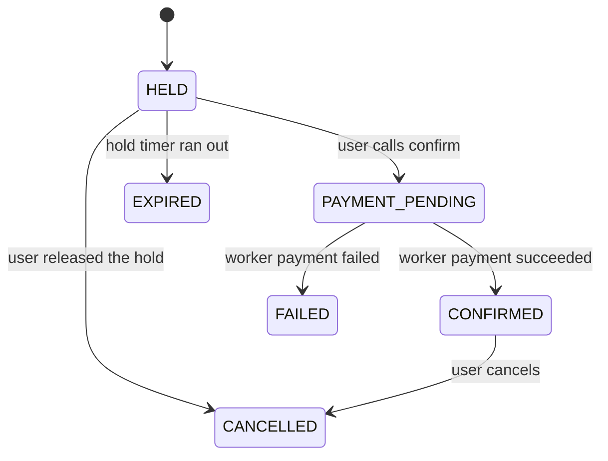

# Seat Booking Service

A small ticket-booking backend where a seat can be held by only one person at a time. The NestJS API holds and confirms seats with single-document atomic updates in MongoDB. A separate worker, fed by BullMQ on Redis, runs a mock payment and releases holds that expire. The web app is a seat grid. There is no user registration: callers send an `x-user-id` header.

**Live demo:** not deployed yet. The URL will be added here after the VM deploy in Phase 8.

## Architecture

The API and the worker are the only application processes. MongoDB stores events, seats, and bookings. Redis carries jobs. nginx serves the built seat grid and proxies `/api` to the API. Mongo and Redis are not exposed publicly.



See [docs/architecture.md](docs/architecture.md).

## State machines

Illegal transitions return HTTP 409. Terminal booking states are `EXPIRED`, `FAILED`, and `CANCELLED`. Tables and the same diagrams are in [docs/state-machines.md](docs/state-machines.md).

### Seat



### Booking



## Quick start

Requirements: Docker with Compose, and Node.js 20 if you work on the packages outside Compose.

```bash
cp .env.example .env
docker compose up --build
```

That command is the intended way to start mongo, redis, api, worker, and web together. `docker-compose.yml` and the Dockerfiles are added in Phase 5, so the command does not start the system yet.

Copy [.env.example](.env.example) for local values. Do not commit a real `.env`.

| Variable | Default | Purpose |
| --- | --- | --- |
| `MONGO_URL` | `mongodb://mongo:27017/seatbooking` | MongoDB connection |
| `REDIS_URL` | `redis://redis:6379` | Redis connection |
| `HOLD_DURATION_SECONDS` | `300` | How long a hold lasts |
| `PAYMENT_SUCCESS_RATE` | `0.9` | Mock payment success probability |
| `PORT` | `3000` | API port |

## API

Base path: `/api`. Every write endpoint requires a non-empty `x-user-id` header. Confirm also requires `Idempotency-Key`.

Errors use `{ statusCode, error, message }`.

| Code | When |
| --- | --- |
| 400 | Validation failed |
| 403 | Booking belongs to another user |
| 404 | Not found |
| 409 | Illegal transition, or the seat is already taken |

| Method | Path | Description |
| --- | --- | --- |
| POST | `/api/events` | Create an event `{name, startsAt, rows, seatsPerRow}` and bulk-create seats |
| GET | `/api/events` | List events with available-seat counts |
| GET | `/api/events/:id/seats` | List seats and their status |
| POST | `/api/seats/:seatId/hold` | Hold a seat and create a `HELD` booking. 409 if it is not available |
| POST | `/api/bookings/:id/confirm` | Move the booking to `PAYMENT_PENDING` and enqueue one payment job |
| POST | `/api/bookings/:id/release` | Release an active hold |
| POST | `/api/bookings/:id/cancel` | Cancel a `CONFIRMED` booking |
| GET | `/api/bookings/:id` | Booking status. The client polls this after confirm |
| GET | `/api/health` | Liveness. Checks Mongo and Redis |

## Design decisions

**Atomic update instead of a lock.** A hold is one `findOneAndUpdate` whose filter matches only a seat that is `AVAILABLE`, or `HELD` with `holdExpiresAt` already in the past. The update sets `HELD`, the holder, and the expiry, and increments `version`. If the document is not matched, the response is 409. Two API instances can race; Mongo applies the write once. An in-process mutex would not hold across instances.

**Compare-and-set on every transition.** Confirm, release, cancel, payment success, payment failure, and expiry all filter on the status they expect to leave. A lost race updates nothing. The caller gets 409, or the worker no-ops. A later write cannot overwrite a status it did not observe.

**Sweep job.** Hold expiry is also a delayed BullMQ job. That job can be lost if Redis restarts. Every 60 seconds the worker releases seats that are still `HELD` and whose `holdExpiresAt` is in the past. The queue is an optimization. The sweep and the compare-and-set filters keep the data right when jobs are dropped or duplicated.

**Idempotency keys.** Confirm requires `Idempotency-Key`. A sparse unique index on `idempotencyKey` makes a second insert fail with a duplicate-key error; the API then loads and returns the existing booking. The payment job id is `payment:<bookingId>`, so BullMQ ignores a second enqueue of the same payment.

**Seat first, then booking.** Seat and booking are two documents, and this project does not use multi-document transactions. The seat is the contended resource, so it is updated first. The booking is updated second. If the booking write fails, the API or worker logs it and the sweep repairs expired holds. The cost is a window where the seat and the booking disagree. That window is accepted here and called out so it is not mistaken for a transaction.

Server time (`new Date()`) is the only clock. Client timestamps are ignored.

## Failure scenarios

**Worker crashes mid-payment.** The payment handler checks the booking before it changes anything. If the booking is already `CONFIRMED` or `FAILED`, the job completes and does nothing. If the process dies before that status is written, BullMQ retries infrastructure failures up to 3 times with exponential backoff. A payment decline is not retried. Because the payment is a mock, a crash before the status write runs the mock again on retry. The seat update is still compare-and-set from `HELD`, so a retry cannot book a seat that another path already released.

**Redis restarts and jobs disappear.** Delayed expiry jobs may be gone. The 60-second sweep finds `HELD` seats past `holdExpiresAt` and releases them. A confirm that already set `PAYMENT_PENDING` but lost its payment job stays pending until a later retry or a new enqueue; the sweep does not invent a payment result. Correctness of seat ownership does not depend on every job surviving.

**Client retries confirm.** The same `Idempotency-Key` hits the unique index and returns the original booking. The job id `payment:<bookingId>` keeps a duplicate enqueue from creating a second payment job.

## Load-test results

Not run yet. After Phase 7, the numbers will be copied here from [loadtest/results.md](loadtest/results.md).

Planned checks:

- Scenario A: 200 concurrent holds of one seat. Expect 1 success and 199 conflicts, and exactly one holder in Mongo.
- Scenario B: 500 users, 100 seats, 30 seconds. Expect no seat with two active bookings. Report requests per second, p95 latency, and conflict rate.

## At 100x scale

- Shard seat documents by event so one hot event does not pin a single chunk of writes.
- Run MongoDB as a replica set and use multi-document transactions when seat and booking must commit together.
- Add an outbox so a booking change and its queue message are recorded in one place, then published, instead of enqueueing only after a second write.
- Rate-limit holds and confirms per `x-user-id`.
- Add metrics, structured logs, and traces for hold conflicts, payment outcomes, sweep repairs, and queue lag.

## Repository layout

```
SPEC.md
README.md
.env.example
package.json
docs/architecture.md
docs/state-machines.md
packages/shared/          # state machines, enums, shared types
services/api/             # NestJS booking API
services/worker/          # BullMQ worker
web/                      # React seat grid
loadtest/results.md
.github/workflows/        # ci.yml and deploy.yml in Phase 8
```

`packages/shared` is imported by the API and the worker so both use the same transition rules. Build order is in [SPEC.md](SPEC.md) Section 16. Application code starts at Phase 1.
