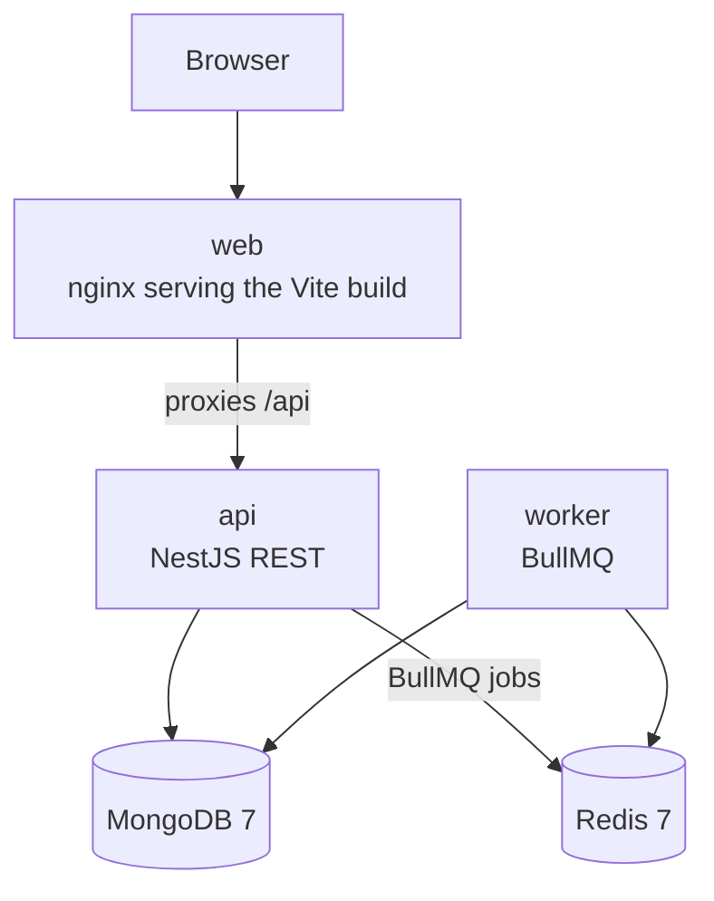

# Architecture

Two processes share one database and one queue. The API accepts booking commands. The worker applies payment results and releases expired holds. MongoDB is the source of truth. Redis only carries jobs.

| Piece | Role |
| --- | --- |
| web | Seat grid. nginx serves the Vite build and proxies `/api` to the API. |
| api | Creates events and seats, holds seats, confirms, releases, and cancels. Enqueues payment and hold-expiry jobs. |
| worker | Mock payment, delayed hold expiry, and a 60-second sweep for lost jobs. |
| MongoDB | Events, seats, and bookings. Seat holds use a single-document atomic update. |
| Redis | BullMQ queues: `payments` and `hold-expiry`, plus the repeatable sweep. |
