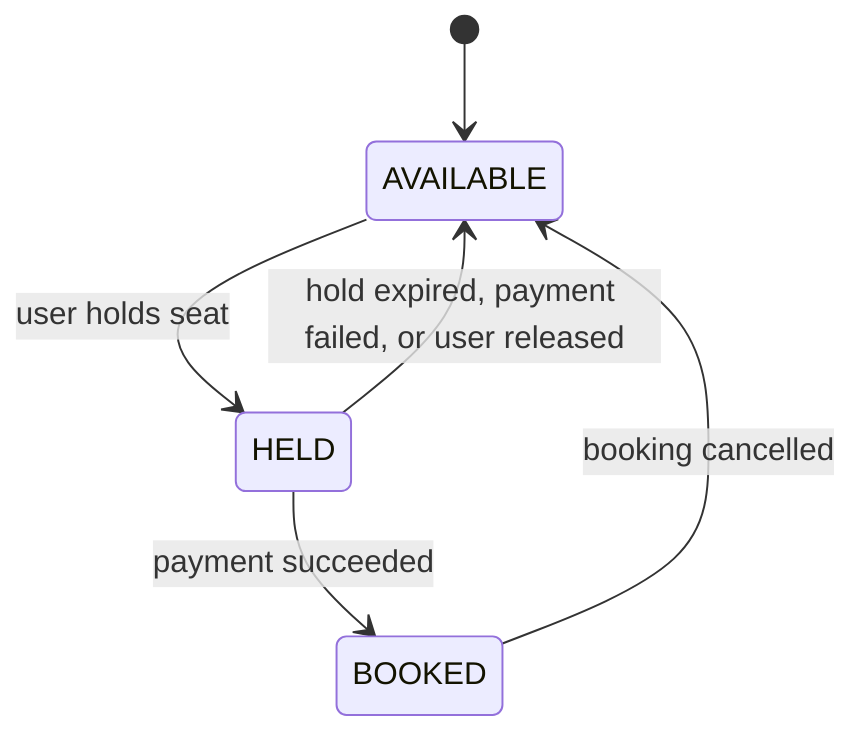
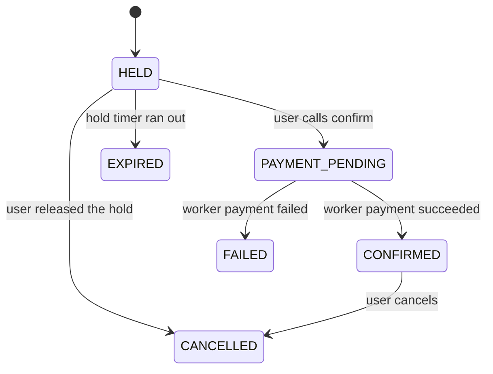

# State machines

Both machines live as transition tables in `packages/shared`. Every status change in the API and the worker must go through `canTransition(from, to)` and `assertTransition(from, to)`. `assertTransition` throws on an illegal move. Anything not in the table is illegal and the API returns HTTP 409.

Terminal booking states: `EXPIRED`, `FAILED`, `CANCELLED`.

## Seat

| From | To | Trigger |
| --- | --- | --- |
| AVAILABLE | HELD | user holds seat |
| HELD | AVAILABLE | hold expired, payment failed, or user released |
| HELD | BOOKED | payment succeeded |
| BOOKED | AVAILABLE | booking cancelled |

## Booking

| From | To | Trigger |
| --- | --- | --- |
| HELD | PAYMENT_PENDING | user calls confirm |
| HELD | EXPIRED | hold timer ran out |
| HELD | CANCELLED | user released the hold |
| PAYMENT_PENDING | CONFIRMED | worker: payment succeeded |
| PAYMENT_PENDING | FAILED | worker: payment failed |
| CONFIRMED | CANCELLED | user cancels |
